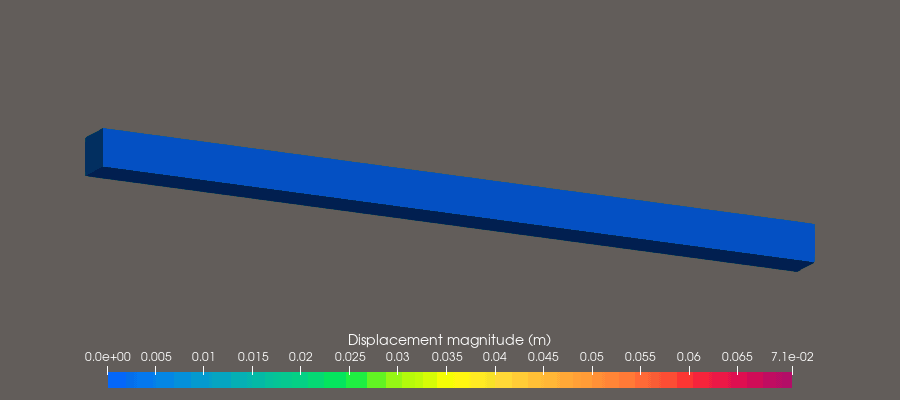
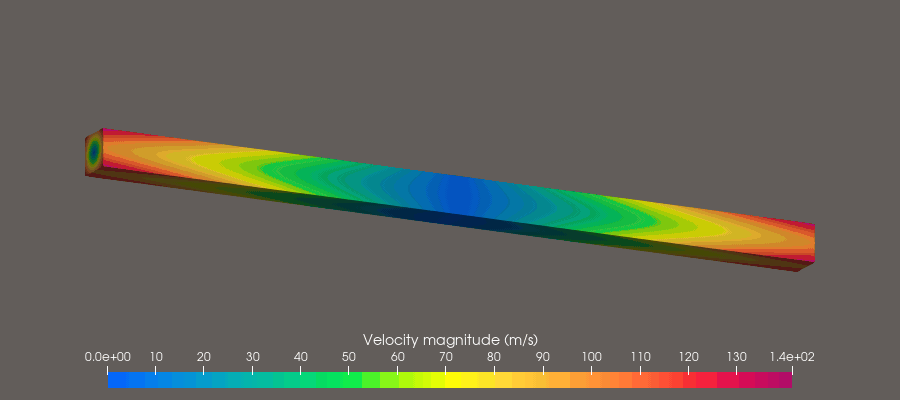
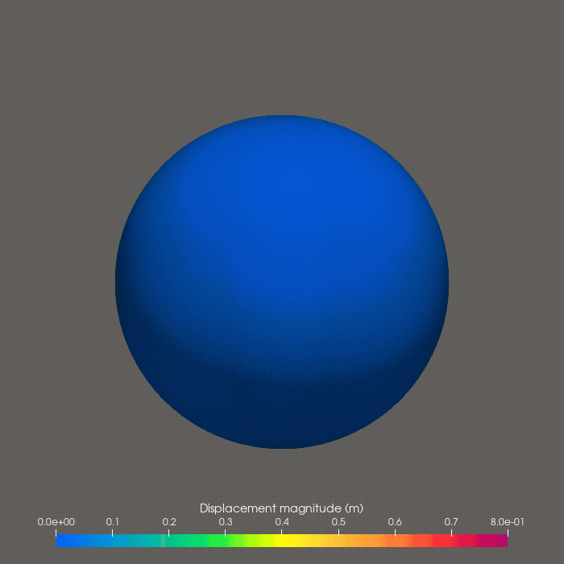
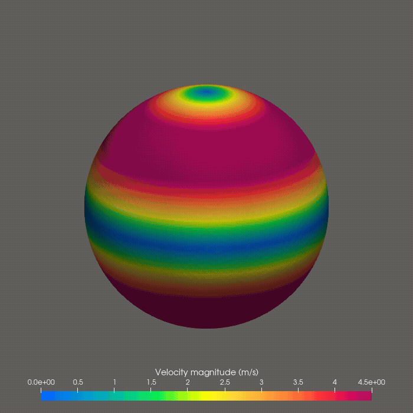
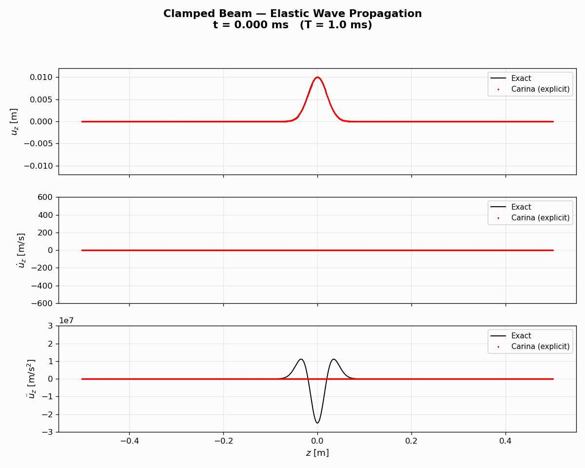

# Carina

**Carina.jl** is a finite element framework for **coupling and multiphysics
simulations**, primarily in **solid mechanics and heat conduction**. As the
spiritual successor to [Norma.jl](https://github.com/sandialabs/Norma.jl),
Carina introduces **GPU acceleration** via
[KernelAbstractions.jl](https://github.com/JuliaGPU/KernelAbstractions.jl),
targeting CPUs, NVIDIA GPUs, and AMD GPUs from a single code base.

## Simulations

### Torsion wave — explicit central difference on AMD GPU

A free 1 m × 50 mm × 50 mm neo-Hookean elastic bar is given an initial angular
velocity field that launches torsion waves from every cross-section
simultaneously. The waves superimpose, and the bar cycles through two complete
twist-and-return sequences before the animation loops.

| Displacement magnitude | Velocity magnitude |
|:---:|:---:|
|  |  |

*Neo-Hookean solid (E = 1 GPa, ν = 0.25, ρ = 1000 kg/m³). 160,000 hexahedral
elements (~177,000 nodes). Explicit central difference, Δt = 500 ns, ~14,000
steps, 5.95 ms simulated. Wall time: 227 s on an AMD Radeon RX 7600 (ROCm).
Left: displacement magnitude [0, 71 mm]. Right: velocity magnitude
[0, 141 m/s]. Rainbow Uniform colormap; geometry warped by actual
displacements.*

### Sphere torsion — implicit Newmark on CPU

A free unit neo-Hookean sphere is given an initial angular velocity field that
twists the top and bottom hemispheres in opposite directions, launching
torsional waves into the interior. The sphere undergoes large torsional
deformation as wave energy accumulates, reaching peak displacements of ~2.1 m
before the restoring force reverses the motion.

| Displacement magnitude | Velocity magnitude |
|:---:|:---:|
|  |  |

*Neo-Hookean solid (E = 10 kPa, ν = 0.33, ρ = 1000 kg/m³). 864 hexahedral
elements (997 nodes). Implicit Newmark-β (β = 0.49, γ = 0.9) with CG + Jacobi
preconditioner, Δt = 10 ms, 400 steps, 4.0 s simulated. Left: displacement
magnitude [0, 0.8 m]. Right: velocity magnitude [0, 4.5 m/s]. Rainbow Uniform
colormap; geometry warped by actual displacements.*

### Elastic wave propagation — clamped beam

A 1 m linear elastic beam (1 mm × 1 mm cross section) clamped at both ends is
given a Gaussian displacement pulse centered at the midpoint. The pulse splits
into two counter-propagating waves that reflect off the clamped boundaries and
return to form the mirror image of the initial condition at t = T = L/c = 1 ms.
The computed solution (red) is overlaid on the closed-form analytical solution
(black).



*Linear elastic (E = 1 GPa, ν = 0, ρ = 1000 kg/m³); wave speed c = 1000 m/s.
1000 hexahedral elements (4004 nodes). Explicit central difference,
Δt = 100 ns, 10,000 steps, 1 ms simulated. Top: z-displacement. Middle:
z-velocity. Bottom: z-acceleration. Analytical solution: Mota, Tezaur &
Phlipot, IJNME 123:5036–5071, 2022, eq. 28.*

## Quick start

```bash
# self-activating CLI wrapper (recommended)
bin/carina input.yaml

# on a GPU
bin/carina input.yaml --device rocm

# multi-threaded on CPU
bin/carina input.yaml --threads 8

# or directly with Julia
julia --project=. src/Carina.jl input.yaml
```

See [Installation](installation.md) to set up the environment and [Running
Carina](running.md) for the full set of ways to launch a simulation.

## Documentation

- [Installation](installation.md)
- [Running Carina](running.md)
- [Features](features.md) — what Carina supports today
- [Testing](testing.md)
- [Examples](examples.md)
- [Troubleshooting](troubleshooting.md)
- **[Input File Reference](reference/index.md)** — every section and key of the YAML input file
